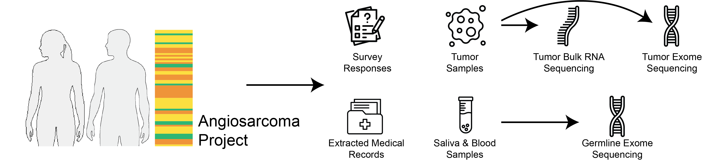

# Angiosarcoma Project Code Directory

Analysis code for Chu, Hollyer, Borden et al., *Patient-partnered multiomics reveals the molecular architecture of angiosarcoma*, Nat. Commun. 17, 9032 (2026). https://doi.org/10.1038/s41467-026-75810-2

Run scripts from inside their own directory, in numeric order. Some scripts need outputs from another directory; each directory's README notes these, along with the figures each script produces and its outputs.

| Directory | Contents | Figures |
| --- | --- | --- |
| [`00_Preprocessing`](00_Preprocessing/) | Builds analysis-ready clinical, sample and treatment tables | – |
| [`01_Clinical_Data_Analysis`](01_Clinical_Data_Analysis/) | Cohort demographics, metastases, prior cancers, treatments | Fig. 1; Supp. Figs. 1–4 |
| [`02_Tumor_RNA_Analysis`](02_Tumor_RNA_Analysis/) | RNA-seq QC, clustering, differential expression, pathway enrichment | Fig. 2; Supp. Figs. 5–21 |
| [`03_Tumor_WES_Analysis`](03_Tumor_WES_Analysis/) | Somatic mutations, signatures, copy number | Fig. 3; Supp. Figs. 22–23 |
| [`04_Germline_WES_Analysis`](04_Germline_WES_Analysis/) | Germline pathogenic variants and burden test | Fig. 4 |
| [`05_Germline_WES_Tumor_WES_Analysis`](05_Germline_WES_Tumor_WES_Analysis/) | Germline + somatic (two-hit) scan | Fig. 5a–c |
| [`06_Tumor_RNA_WES_Integration_Analysis`](06_Tumor_RNA_WES_Integration_Analysis/) | Expression differences by mutation status | Fig. 5e–f; Supp. Fig. 25 |
| [`data`](data/) | Supplementary data, inputs, references, cBioPortal ID maps | – |
| [`util_scripts`](util_scripts/) | Shared color palettes | – |

## Data

- **Start with [`data/supplementary_data/`](data/supplementary_data/)**: the de-identified data released with the paper (`SD1`–`SD9`). [`data/README.md`](data/README.md) describes every data file.
- **Missing a file?** Large files are not on GitHub. Download the full snapshot (~1.75 GB, same layout) from Zenodo: https://zenodo.org/records/20416385

## FAQ: Differences from cBioPortal ([`angs_painter_2025`](https://www.cbioportal.org/study/summary?id=angs_painter_2025))

- **IDs differ:** Legacy IDs (`ASCProject_0005`) were renamed for cBioPortal (`PRLB6M`). Convert with [`data/id_mapping/`](data/id_mapping/).
- **Counts differ:** cBioPortal is a later, provisional release; this repository applies extra QC.
- **Mutation counts differ:** `ASC_mutations.maf` includes silent and non-coding variants.
- **Copy number differs:** CNVkit-based gene calls here vs. GISTIC calls on cBioPortal.

Details: [full FAQ](data/README.md#faq-differences-from-cbioportal).

## Contact

hoyinchu2016@gmail.com
